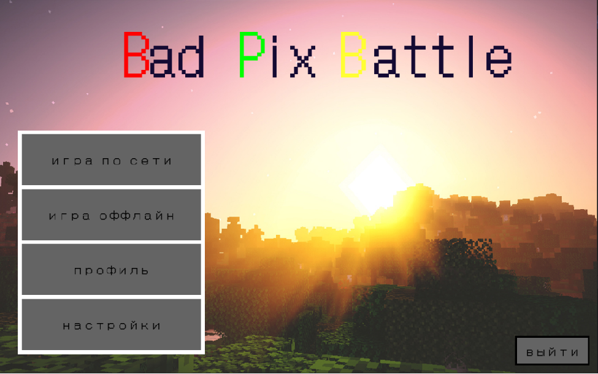
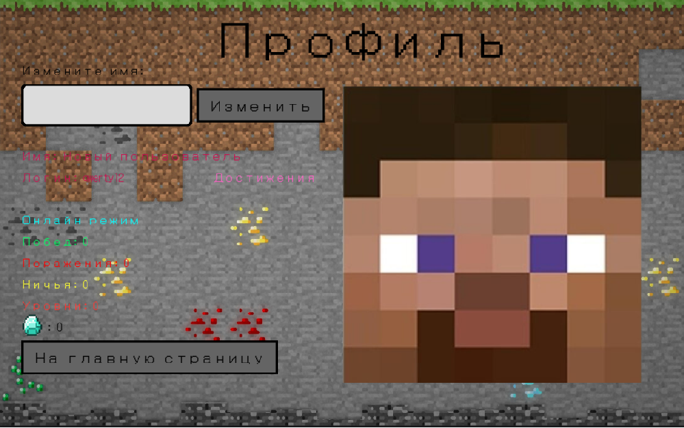
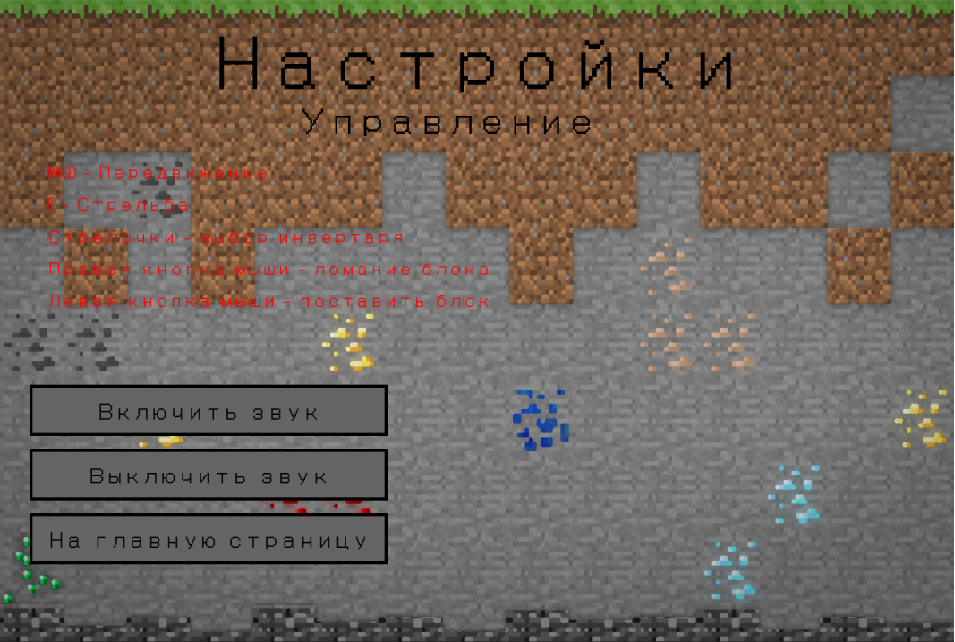
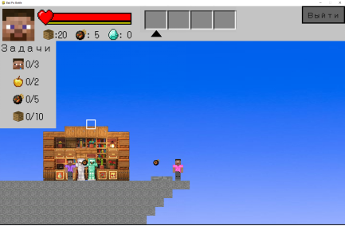
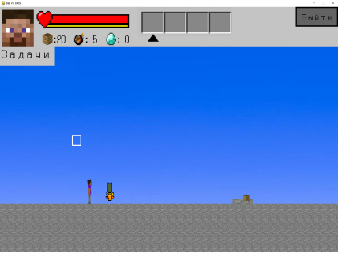

# Ссылки на исходники проекта:
**Виктор, обязательно посмотрите во вкладке(video)**

**Git Hub** -  https://github.com/Vova1707/Bad-Pix-Battle.git
**Replit** - https://replit.com/join/ffsuuzucty-kondrahinvov
# 🎮 Bad Pix Battle

**Bad Pix Battle** - это пиксельная 2D игра, вдохновленная режимом "Bed Wars" из "Minecraft". Погрузитесь в мир, где пиксели сражаются за Ваше внимание, а стратегические навыки — это ключ к победе!

## 🌟 Идея

В этой игре Ваша главная задача — заменить собой Bed Wars из Minecraft, но в 2D пиксельной версии! С удобным интерфейсом и возможностью играть по сети(в этапе разработки), Bad Pix Battle обещает быть не только увлекательной, но и веселой!

### 🎯 Цели игры:
- Зарегистрируйтесь в игре(это не так уж и просто)
- Пройдите все уровни  режима offline и соберите все награды
- Попытайтесь запустить online режим(на вашем месте я этого бы лучше не делал)
- Получите удовольствие от пиксельной графики и динамичного игрового процесса!

## 🚀 Инструкция по запуску
1. Запустите файл `server.py` (Для online режима это необходимо)
2. Запустите файл `main_window.py` или `Bad_Pix_Battle.exe` (выбор за вами, но помните: с большим файлом приходит большая ответственность!).
3. Начните получать удовольствие от игрового процесса! 🎉

## 📸 Скриншоты

Вот несколько скриншотов из игры, чтобы Вы могли оценить, как это выглядит:

## 📜 Лицензия

Этот проект не имеет лицензии, но является проектом Яндекс Лицея📚
---

Присоединяйтесь к битве и станьте мастером Bad Pix Battle! 🏆
