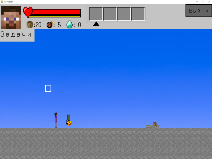
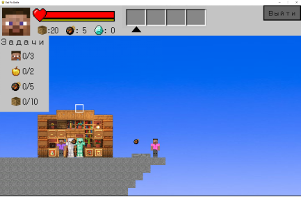

Bad Pix Battle

Bad Pix Battle - это многопользовательскаяпиксельная 2D игра, которая является аналогом режима "Bed Wars" в "Minecraft".

Главная задача этой игры - заменить собой Bed Wars из игры Minecraft на её 2D пиксельную версию. Она будет завлекать пользователей своим удобным интерфейсом и возможностью играть по сети. 

Инструкция запуска:
1. Запустить файл server.py
2. Запустить файл main_window.py
3. Начать играть

Вот скрины с игры:

